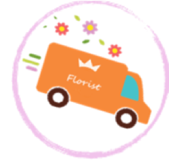

<!-- 

# React Template

A template for starting projects with `react`. Includes authentication.

## Dependencies

Install with `npm install`.

-

## Installation

### Download Template:

1.  [Download](../../archive/master.zip) this template.
1.  Unzip and rename the template directory (`unzip ~/Downloads/react-template-master.zip`)
1.  Move into the new project and `git init`.

### Customize Template:

1.  Empty [`README.md`](README.md) and fill with your own content.

### Setup Environment:

1.  Install dependencies with `npm install`.
1.  `git add` and `git commit` your changes.

### Run your server!

1. Run the API server with `npm start`.

## Structure

User authentication is built-in.

## Tasks

Developers should run these often!

- `npm start`
- `npm run deploy`

### Authentication

## [License](LICENSE)

1.  All content is licensed under a CC­BY­NC­SA 4.0 license.
1.  All software code is licensed under GNU GPLv3. For commercial use or
    alternative licensing, please contact legal@ga.co. -->
 
# Florist

Florist is a website that connect the florist with customerts to buy flowers from different flower stores. 

there are two type of end users: 
1- florist: the owner can sign-up,log-in, add store and flower, edit, and delete it. 
2- customer: the customer can sign-up,log-in, view store and flower. 

#

Store data:

- store name
- location
- email 
- phone number
- image

Flower data:

- flower name
- price
- information 
- image
#

***The most difficult part of the project:***

- creating the database, and seeding the data.
- designing the front-end.

***Favourite part to work on:***
- learning more about the react and express, and how to debug the errors.
- styling the front-end.

***Future plans:*** 
1- I would like to add the payment method cash, or by credit card. 
2- I would like to add a google map that will show the nearest flower stores to the user. 
3- i would like to add a filter menu to let the user to search the flower based on price, occasions,etc. 

# Acknowledgement:
I would like to thank Michael Finneran,Ghadeer Alkhathlan, and Usman Bashir for helping and assisting me in this project.